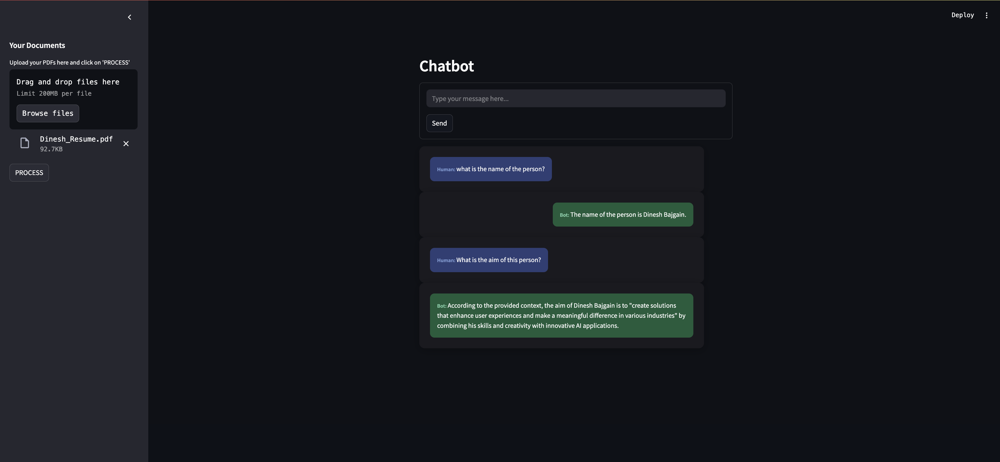
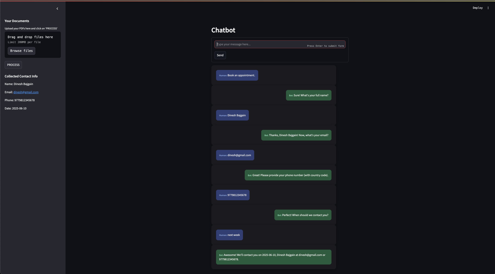

#  Chat-Powered PDF Assistant

This is a Streamlit-powered AI chatbot that allows users to:
- Ask questions about uploaded PDF documents
- Book appointments using natural language (e.g., "next Tuesday")
- Provide their contact information conversationally
- Store all collected info in a CSV for admin access

---

## Tech Stack

- Streamlit
- LangChain
- FAISS
- SentenceTransformers
- Ollama
- Dateparser

---

## Features

- **Ask questions from uploaded PDFs**
- **Conversational interface with memory**
- **Powered by LangChain's ConversationalRetrievalChain**
- **Date parsing with natural language (e.g., 'next Monday')**
- **Validates email & phone numbers**
- **Saves contact info to CSV**

---

## Getting Started

### Prerequisites

- A modern web browser (Chrome, Firefox, etc.)  
- Internet connection

### How to Run

- Clone the repo: => git clone https://github.com/dinesh-bazgain/chatbot.git

### Set up environment

- Create a virtual environment for the project.
- pip install -r requirements.txt
- You'll also need to download the [Ollama](https://ollama.com/) and run it locally. 
    => ollama serve
- Run the app.
    => streamlit run app.py

### How it works
- Upload one or more PDF files
- Text is extracted and chunked
- FAISS vector store is created with SentenceTransformer embeddings
- Ask natural language questions and get responses from your docs using ChatOllama and ConversationalRetrievalChain

### Contact Info Collection
- If the user types phrases like "call me", "book an appointment", or "contact me", the bot triggers a contact flow
- Step-by-step form inside chat:
    Name
    Email (with regex validation)
    Phone (with regex validation)
    Preferred contact date (parsed using dateparser)
- Info is saved in contact_data.csv for admin use

### Future Improvements
- Admin dashboard to view/export full contact history
- Admin login for access control
- AI tool-agents
- Integration with email or SMS API to notify admins
---

## License

MIT — feel free to use, modify, and deploy!

---

## Contact

Feel free to reach out to me via [email](dinesh.bazgain@gmail.com) or open an issue on GitHub!

---

## Demo Images

### Happy coding and converting!!!
